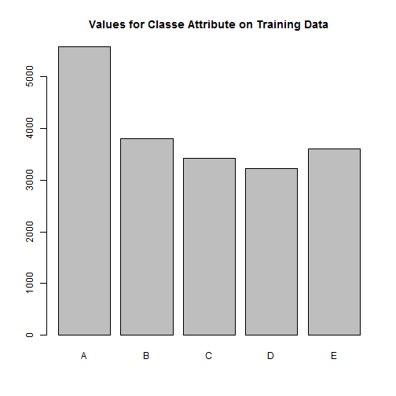
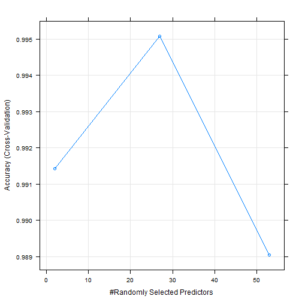

# Practical Machine Learning - Prediction

## Executive Summary

The goal of this project was to predict *how well* individuals did certain exerise activities using machine data collected from such devices as Jawbone Up, Nike FuelBand, and Fitbit (normally individuals *quantify how much* of a particular activity they do, but they rarely quantify how well they do it).

A Machine Learning Prediction model was build using Random Forest algorithm. When testing the model against the Training (60%) data set used to build the model the **In Sample** accuracy is 100%, with no false-positives or false-negatives. Next we tested our model with the testing data set (40%) which calculates the **Out of Sample** accuracy to be 99.5%. Finally we took the 20 test observation cases and each of these were classified successfully.

##  Background / Context

Six young health participants were asked to perform one set of 10 repetitions of the Unilateral Dumbbell Biceps Curl in five different fashions (accelerometers were on the belt, forearm, arm, and dumbell). The outcome of each were captured in the Training Data Set under the *Classe* variable : 

Class **A** - exactly according to the specification.

Class **B** - throwing the elbows to the front.

Class **C** - lifting the dumbbell only halfway.

Class **D** - lowering the dumbbell only halfway.

Class **E** - and throwing the hips to the front.


Class A corresponds to the specified execution of the exercise, while the other 4 classes correspond to common mistakes.

More information: <http://groupware.les.inf.puc-rio.br/har>

## Approach Taken
The following key steps were undertaken to construct the model:

1. The Data Sets (Training and Test) were loaded
2. Exploratory Data Analysis undertaken to understand both data sets
3. Cleansing activity on the data sets to remove NA and invalid Data (#DIV/0!)
4. Removal of Predictors which had little value to the model
5. Data Partitioning of data into a Training and Test Set (60%/40%)
6. Training of data using Random Forest algorithm within the *Caret* Package
7. Prediction of data:

    7a. against Training data; 
    7b. against Test data; 
    7c. against 20 observations Test Set
8. Writing of prediction answers from Step 7c to files and submission.

## Initialisation
First we ensure that the **Caret** package is available.

```r
install.packages("caret"); library(caret)
```

```
## Installing package into 'C:/Users/Home/Documents/R/win-library/3.1'
## (as 'lib' is unspecified)
```

```
## package 'caret' successfully unpacked and MD5 sums checked
## 
## The downloaded binary packages are in
## 	C:\Users\Home\AppData\Local\Temp\RtmpqiaMQL\downloaded_packages
```

```
## Warning: package 'caret' was built under R version 3.1.3
```

```
## Loading required package: lattice
## Loading required package: ggplot2
```

```
## Warning: package 'ggplot2' was built under R version 3.1.3
```

## File Processing
The training data for this project are available here: 

<https://d396qusza40orc.cloudfront.net/predmachlearn/pml-training.csv>

The test data are available here: 

<https://d396qusza40orc.cloudfront.net/predmachlearn/pml-testing.csv>

I saved these files to my local file system prior to loading.

```r
setwd("c:/DataScience/MachineLearning")

# Read in Training Set
DF.train <- read.csv("pml-training.csv", header=TRUE, na.strings=c("NA",""," ","#DIV/0!"))

# Read in Testing Set
DF.test<-read.csv("pml-testing.csv", header=TRUE, na.strings=c("NA",""," ","#DIV/0!"))
```


## Exploratory Data Analysis

Both the Training and Test Data sets contain 160 Columns.
The Training Set has 19622 Observations and the Test set has 20.

A Structure of the Training Data set can be found in the Appendix at the end of this report.

Initial analysis identified there were a lot of columns containing **NA**.
The 1st 6 columns of the Training Data set did not appear to be accelerometer measures.
Caution should be taken with the  **user_name** predictor variable given different individuals may have the same user_name. In the data analysed the user_name appears to be an individual's forename. 

```r
nrow(DF.train) 
```

```
## [1] 19622
```

```r
ncol(DF.train) 
```

```
## [1] 160
```

```r
nrow(DF.test)
```

```
## [1] 20
```

```r
ncol(DF.test) 
```

```
## [1] 160
```


It is useful to understand the relative spread of the *Classe* variable across the Training Data Set.

```r
summary(DF.train$classe)
```

```
##    A    B    C    D    E 
## 5580 3797 3422 3216 3607
```

```r
plot(DF.train$classe)
title(main = "Values for Classe Attribute on Training Data")
```

 

## Data Cleansing

We start by reducing the number of features/predictors (from the initial 160 at the start)
from both Train and Test Data Sets to remove Columns containing **NA***.
Also remove the 1st 6 columns 

```r
# reduce number of columns to 60 (removing any Columns with NA)
DF2.train <- DF.train[ , ! apply( DF.train , 2 , function(x) any(is.na(x)) ) ]

DF2.test <- DF.test[ , ! apply( DF.test , 2 , function(x) any(is.na(x)) ) ]

# remove 1st 6 columns
DF2.train <- DF2.train[,c(-1:-6)]
DF2.test <- DF2.test[,c(-1:-6)]
```

## Data Slicing / Partitioning

Now we will partition the Training Data Set into Training (60%) and Test (40%).

```r
inTrain <- createDataPartition(y=DF2.train$classe,
                               p=0.60, list=FALSE)
training <- DF2.train[inTrain,]
testing <- DF2.train[-inTrain,]

dim(training)
```

```
## [1] 11776    54
```


## Training

Next we train the data using the **train** function within the **caret** package; alternatively we could have called the **randomForest** function directly within the RandomForest Package.

For the purposes of this I have specified **5-fold cross validation** and restricted the number of trees to 50. For reproducibility purposes I have also added a *seed*.

```r
set.seed(54321)
modelFit.rf <- train(classe ~.,data=training, method="rf", ntree=50, prox=TRUE,
trControl = trainControl(method="cv", number=5))
```

```
## Loading required package: randomForest
```

```
## Warning: package 'randomForest' was built under R version 3.1.3
```

```
## randomForest 4.6-10
## Type rfNews() to see new features/changes/bug fixes.
```

```r
modelFit.rf
```

```
## Random Forest 
## 
## 11776 samples
##    53 predictor
##     5 classes: 'A', 'B', 'C', 'D', 'E' 
## 
## No pre-processing
## Resampling: Cross-Validated (5 fold) 
## 
## Summary of sample sizes: 9420, 9421, 9421, 9421, 9421 
## 
## Resampling results across tuning parameters:
## 
##   mtry  Accuracy   Kappa      Accuracy SD  Kappa SD   
##    2    0.9914235  0.9891498  0.002444978  0.003094121
##   27    0.9950750  0.9937703  0.001911780  0.002417916
##   53    0.9890457  0.9861437  0.002931411  0.003707679
## 
## Accuracy was used to select the optimal model using  the largest value.
## The final value used for the model was mtry = 27.
```

Next we identify the top 20 important variables for this model: *num_window* and *roll_belt* appear to be the most important.


```r
varImp(modelFit.rf)
```

```
## rf variable importance
## 
##   only 20 most important variables shown (out of 53)
## 
##                      Overall
## num_window           100.000
## roll_belt             65.873
## pitch_forearm         41.308
## yaw_belt              29.281
## magnet_dumbbell_z     28.793
## magnet_dumbbell_y     28.749
## pitch_belt            28.149
## roll_forearm          21.781
## accel_dumbbell_y      12.253
## roll_dumbbell         11.705
## magnet_dumbbell_x     10.510
## magnet_belt_z          9.756
## accel_belt_z           9.049
## total_accel_dumbbell   9.032
## accel_forearm_x        8.934
## accel_dumbbell_z       8.125
## magnet_belt_y          6.905
## magnet_forearm_z       5.260
## roll_arm               5.226
## accel_dumbbell_x       4.962
```

The plot below shows the maximum accuaracy for Predictor 27.

```r
plot(modelFit.rf)
```

 


## Prediction

We shall first test our model with the Training Data Set (60%) that this model was trained on.
Unsurprisingly the **In Sample** accuracy is 100%, with no false-positives or false-negatives.


```r
ModelPred <- predict(modelFit.rf, training) 
confusionMatrix(ModelPred,training$classe)
```

```
## Confusion Matrix and Statistics
## 
##           Reference
## Prediction    A    B    C    D    E
##          A 3348    0    0    0    0
##          B    0 2279    0    0    0
##          C    0    0 2054    0    0
##          D    0    0    0 1930    0
##          E    0    0    0    0 2165
## 
## Overall Statistics
##                                      
##                Accuracy : 1          
##                  95% CI : (0.9997, 1)
##     No Information Rate : 0.2843     
##     P-Value [Acc > NIR] : < 2.2e-16  
##                                      
##                   Kappa : 1          
##  Mcnemar's Test P-Value : NA         
## 
## Statistics by Class:
## 
##                      Class: A Class: B Class: C Class: D Class: E
## Sensitivity            1.0000   1.0000   1.0000   1.0000   1.0000
## Specificity            1.0000   1.0000   1.0000   1.0000   1.0000
## Pos Pred Value         1.0000   1.0000   1.0000   1.0000   1.0000
## Neg Pred Value         1.0000   1.0000   1.0000   1.0000   1.0000
## Prevalence             0.2843   0.1935   0.1744   0.1639   0.1838
## Detection Rate         0.2843   0.1935   0.1744   0.1639   0.1838
## Detection Prevalence   0.2843   0.1935   0.1744   0.1639   0.1838
## Balanced Accuracy      1.0000   1.0000   1.0000   1.0000   1.0000
```

Next we test our model with the testing data set (40%) which calculates the **out of Sample** accuracy to be 99.5%

```r
ModelPred <- predict(modelFit.rf, testing) 

confusionMatrix(ModelPred,testing$classe)
```

```
## Confusion Matrix and Statistics
## 
##           Reference
## Prediction    A    B    C    D    E
##          A 2232    8    0    0    0
##          B    0 1505    7    0    0
##          C    0    4 1361   10    0
##          D    0    1    0 1275    5
##          E    0    0    0    1 1437
## 
## Overall Statistics
##                                           
##                Accuracy : 0.9954          
##                  95% CI : (0.9937, 0.9968)
##     No Information Rate : 0.2845          
##     P-Value [Acc > NIR] : < 2.2e-16       
##                                           
##                   Kappa : 0.9942          
##  Mcnemar's Test P-Value : NA              
## 
## Statistics by Class:
## 
##                      Class: A Class: B Class: C Class: D Class: E
## Sensitivity            1.0000   0.9914   0.9949   0.9914   0.9965
## Specificity            0.9986   0.9989   0.9978   0.9991   0.9998
## Pos Pred Value         0.9964   0.9954   0.9898   0.9953   0.9993
## Neg Pred Value         1.0000   0.9979   0.9989   0.9983   0.9992
## Prevalence             0.2845   0.1935   0.1744   0.1639   0.1838
## Detection Rate         0.2845   0.1918   0.1735   0.1625   0.1832
## Detection Prevalence   0.2855   0.1927   0.1752   0.1633   0.1833
## Balanced Accuracy      0.9993   0.9952   0.9964   0.9953   0.9982
```

```r
mean(predict(modelFit.rf, testing) == testing$classe) * 100
```

```
## [1] 99.56666
```

Finally we shall test the model against the provided Test data set of 20 observations.
These figures were fed into the Coursera Practical Machine Learning site **Prediction Assignment Submission** and achieved 100% accuracy (20/20). 

```r
ModelPred <- predict(modelFit.rf, DF2.test) 
answers <- ModelPred
print(answers)
```

```
##  [1] B A B A A E D B A A B C B A E E A B B B
## Levels: A B C D E
```

## Output Results

We shall use a script provided by the Course Tutor to enable creation of 20 files.

```r
pml_write_files = function(x){
  n = length(x)
  for(i in 1:n){
    filename = paste0("problem_id_",i,".txt")
    write.table(x[i],file=filename,quote=FALSE,row.names=FALSE,col.names=FALSE)
  }
}

pml_write_files(answers)
```

## Appendix

The following shows the structure of the loaded **Training data set** prior to cleansing.

```r
str(DF.train)
```

```
## 'data.frame':	19622 obs. of  160 variables:
##  $ X                       : int  1 2 3 4 5 6 7 8 9 10 ...
##  $ user_name               : Factor w/ 6 levels "adelmo","carlitos",..: 2 2 2 2 2 2 2 2 2 2 ...
##  $ raw_timestamp_part_1    : int  1323084231 1323084231 1323084231 1323084232 1323084232 1323084232 1323084232 1323084232 1323084232 1323084232 ...
##  $ raw_timestamp_part_2    : int  788290 808298 820366 120339 196328 304277 368296 440390 484323 484434 ...
##  $ cvtd_timestamp          : Factor w/ 20 levels "02/12/2011 13:32",..: 9 9 9 9 9 9 9 9 9 9 ...
##  $ new_window              : Factor w/ 2 levels "no","yes": 1 1 1 1 1 1 1 1 1 1 ...
##  $ num_window              : int  11 11 11 12 12 12 12 12 12 12 ...
##  $ roll_belt               : num  1.41 1.41 1.42 1.48 1.48 1.45 1.42 1.42 1.43 1.45 ...
##  $ pitch_belt              : num  8.07 8.07 8.07 8.05 8.07 8.06 8.09 8.13 8.16 8.17 ...
##  $ yaw_belt                : num  -94.4 -94.4 -94.4 -94.4 -94.4 -94.4 -94.4 -94.4 -94.4 -94.4 ...
##  $ total_accel_belt        : int  3 3 3 3 3 3 3 3 3 3 ...
##  $ kurtosis_roll_belt      : num  NA NA NA NA NA NA NA NA NA NA ...
##  $ kurtosis_picth_belt     : num  NA NA NA NA NA NA NA NA NA NA ...
##  $ kurtosis_yaw_belt       : logi  NA NA NA NA NA NA ...
##  $ skewness_roll_belt      : num  NA NA NA NA NA NA NA NA NA NA ...
##  $ skewness_roll_belt.1    : num  NA NA NA NA NA NA NA NA NA NA ...
##  $ skewness_yaw_belt       : logi  NA NA NA NA NA NA ...
##  $ max_roll_belt           : num  NA NA NA NA NA NA NA NA NA NA ...
##  $ max_picth_belt          : int  NA NA NA NA NA NA NA NA NA NA ...
##  $ max_yaw_belt            : num  NA NA NA NA NA NA NA NA NA NA ...
##  $ min_roll_belt           : num  NA NA NA NA NA NA NA NA NA NA ...
##  $ min_pitch_belt          : int  NA NA NA NA NA NA NA NA NA NA ...
##  $ min_yaw_belt            : num  NA NA NA NA NA NA NA NA NA NA ...
##  $ amplitude_roll_belt     : num  NA NA NA NA NA NA NA NA NA NA ...
##  $ amplitude_pitch_belt    : int  NA NA NA NA NA NA NA NA NA NA ...
##  $ amplitude_yaw_belt      : int  NA NA NA NA NA NA NA NA NA NA ...
##  $ var_total_accel_belt    : num  NA NA NA NA NA NA NA NA NA NA ...
##  $ avg_roll_belt           : num  NA NA NA NA NA NA NA NA NA NA ...
##  $ stddev_roll_belt        : num  NA NA NA NA NA NA NA NA NA NA ...
##  $ var_roll_belt           : num  NA NA NA NA NA NA NA NA NA NA ...
##  $ avg_pitch_belt          : num  NA NA NA NA NA NA NA NA NA NA ...
##  $ stddev_pitch_belt       : num  NA NA NA NA NA NA NA NA NA NA ...
##  $ var_pitch_belt          : num  NA NA NA NA NA NA NA NA NA NA ...
##  $ avg_yaw_belt            : num  NA NA NA NA NA NA NA NA NA NA ...
##  $ stddev_yaw_belt         : num  NA NA NA NA NA NA NA NA NA NA ...
##  $ var_yaw_belt            : num  NA NA NA NA NA NA NA NA NA NA ...
##  $ gyros_belt_x            : num  0 0.02 0 0.02 0.02 0.02 0.02 0.02 0.02 0.03 ...
##  $ gyros_belt_y            : num  0 0 0 0 0.02 0 0 0 0 0 ...
##  $ gyros_belt_z            : num  -0.02 -0.02 -0.02 -0.03 -0.02 -0.02 -0.02 -0.02 -0.02 0 ...
##  $ accel_belt_x            : int  -21 -22 -20 -22 -21 -21 -22 -22 -20 -21 ...
##  $ accel_belt_y            : int  4 4 5 3 2 4 3 4 2 4 ...
##  $ accel_belt_z            : int  22 22 23 21 24 21 21 21 24 22 ...
##  $ magnet_belt_x           : int  -3 -7 -2 -6 -6 0 -4 -2 1 -3 ...
##  $ magnet_belt_y           : int  599 608 600 604 600 603 599 603 602 609 ...
##  $ magnet_belt_z           : int  -313 -311 -305 -310 -302 -312 -311 -313 -312 -308 ...
##  $ roll_arm                : num  -128 -128 -128 -128 -128 -128 -128 -128 -128 -128 ...
##  $ pitch_arm               : num  22.5 22.5 22.5 22.1 22.1 22 21.9 21.8 21.7 21.6 ...
##  $ yaw_arm                 : num  -161 -161 -161 -161 -161 -161 -161 -161 -161 -161 ...
##  $ total_accel_arm         : int  34 34 34 34 34 34 34 34 34 34 ...
##  $ var_accel_arm           : num  NA NA NA NA NA NA NA NA NA NA ...
##  $ avg_roll_arm            : num  NA NA NA NA NA NA NA NA NA NA ...
##  $ stddev_roll_arm         : num  NA NA NA NA NA NA NA NA NA NA ...
##  $ var_roll_arm            : num  NA NA NA NA NA NA NA NA NA NA ...
##  $ avg_pitch_arm           : num  NA NA NA NA NA NA NA NA NA NA ...
##  $ stddev_pitch_arm        : num  NA NA NA NA NA NA NA NA NA NA ...
##  $ var_pitch_arm           : num  NA NA NA NA NA NA NA NA NA NA ...
##  $ avg_yaw_arm             : num  NA NA NA NA NA NA NA NA NA NA ...
##  $ stddev_yaw_arm          : num  NA NA NA NA NA NA NA NA NA NA ...
##  $ var_yaw_arm             : num  NA NA NA NA NA NA NA NA NA NA ...
##  $ gyros_arm_x             : num  0 0.02 0.02 0.02 0 0.02 0 0.02 0.02 0.02 ...
##  $ gyros_arm_y             : num  0 -0.02 -0.02 -0.03 -0.03 -0.03 -0.03 -0.02 -0.03 -0.03 ...
##  $ gyros_arm_z             : num  -0.02 -0.02 -0.02 0.02 0 0 0 0 -0.02 -0.02 ...
##  $ accel_arm_x             : int  -288 -290 -289 -289 -289 -289 -289 -289 -288 -288 ...
##  $ accel_arm_y             : int  109 110 110 111 111 111 111 111 109 110 ...
##  $ accel_arm_z             : int  -123 -125 -126 -123 -123 -122 -125 -124 -122 -124 ...
##  $ magnet_arm_x            : int  -368 -369 -368 -372 -374 -369 -373 -372 -369 -376 ...
##  $ magnet_arm_y            : int  337 337 344 344 337 342 336 338 341 334 ...
##  $ magnet_arm_z            : int  516 513 513 512 506 513 509 510 518 516 ...
##  $ kurtosis_roll_arm       : num  NA NA NA NA NA NA NA NA NA NA ...
##  $ kurtosis_picth_arm      : num  NA NA NA NA NA NA NA NA NA NA ...
##  $ kurtosis_yaw_arm        : num  NA NA NA NA NA NA NA NA NA NA ...
##  $ skewness_roll_arm       : num  NA NA NA NA NA NA NA NA NA NA ...
##  $ skewness_pitch_arm      : num  NA NA NA NA NA NA NA NA NA NA ...
##  $ skewness_yaw_arm        : num  NA NA NA NA NA NA NA NA NA NA ...
##  $ max_roll_arm            : num  NA NA NA NA NA NA NA NA NA NA ...
##  $ max_picth_arm           : num  NA NA NA NA NA NA NA NA NA NA ...
##  $ max_yaw_arm             : int  NA NA NA NA NA NA NA NA NA NA ...
##  $ min_roll_arm            : num  NA NA NA NA NA NA NA NA NA NA ...
##  $ min_pitch_arm           : num  NA NA NA NA NA NA NA NA NA NA ...
##  $ min_yaw_arm             : int  NA NA NA NA NA NA NA NA NA NA ...
##  $ amplitude_roll_arm      : num  NA NA NA NA NA NA NA NA NA NA ...
##  $ amplitude_pitch_arm     : num  NA NA NA NA NA NA NA NA NA NA ...
##  $ amplitude_yaw_arm       : int  NA NA NA NA NA NA NA NA NA NA ...
##  $ roll_dumbbell           : num  13.1 13.1 12.9 13.4 13.4 ...
##  $ pitch_dumbbell          : num  -70.5 -70.6 -70.3 -70.4 -70.4 ...
##  $ yaw_dumbbell            : num  -84.9 -84.7 -85.1 -84.9 -84.9 ...
##  $ kurtosis_roll_dumbbell  : num  NA NA NA NA NA NA NA NA NA NA ...
##  $ kurtosis_picth_dumbbell : num  NA NA NA NA NA NA NA NA NA NA ...
##  $ kurtosis_yaw_dumbbell   : logi  NA NA NA NA NA NA ...
##  $ skewness_roll_dumbbell  : num  NA NA NA NA NA NA NA NA NA NA ...
##  $ skewness_pitch_dumbbell : num  NA NA NA NA NA NA NA NA NA NA ...
##  $ skewness_yaw_dumbbell   : logi  NA NA NA NA NA NA ...
##  $ max_roll_dumbbell       : num  NA NA NA NA NA NA NA NA NA NA ...
##  $ max_picth_dumbbell      : num  NA NA NA NA NA NA NA NA NA NA ...
##  $ max_yaw_dumbbell        : num  NA NA NA NA NA NA NA NA NA NA ...
##  $ min_roll_dumbbell       : num  NA NA NA NA NA NA NA NA NA NA ...
##  $ min_pitch_dumbbell      : num  NA NA NA NA NA NA NA NA NA NA ...
##  $ min_yaw_dumbbell        : num  NA NA NA NA NA NA NA NA NA NA ...
##  $ amplitude_roll_dumbbell : num  NA NA NA NA NA NA NA NA NA NA ...
##   [list output truncated]
```
